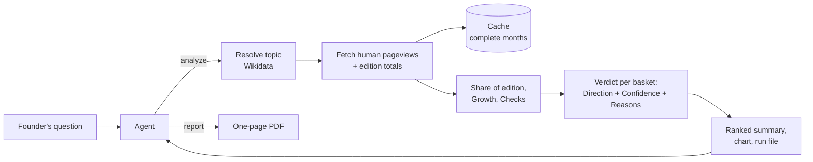

# wiki-interest

An [Agent Skill](https://agentskills.io/specification) that helps founders of B2C products decide which topics to build next and which language audiences to launch in, using Wikipedia pageviews as a signal of interest.

Ask an agent something like *"Is interest in astronomy growing in Ukrainian Wikipedia, and how far can we trust that?"* and the skill gives it a ranked comparison with a growth direction and a confidence level for each topic and language, the reasons behind each confidence level, a chart, and on request a one-page PDF report to share.

> **Status:** in progress. This README is written ahead of the code and describes the agreed design. Sections marked _TBD_ get filled in as the implementation lands.

The skill itself is the [`wiki-interest/`](wiki-interest/) folder. Everything it needs to run is inside it.

## Requirements and install

- Node.js 22.18 or newer (the TypeScript source runs directly on Node, with no build step)
- npm
- Network access to `wikimedia.org` and `wikidata.org`

Install for Claude Code by copying the skill folder into your skills directory and installing its dependencies (without dev tooling):

```sh
mkdir -p ~/.claude/skills
cp -R wiki-interest ~/.claude/skills/
npm ci --omit=dev --prefix ~/.claude/skills/wiki-interest
```

For a single project, use `<project>/.claude/skills/wiki-interest` instead. Other agents that support Agent Skills load the same folder from their own skills directory.

If Node is too old or the dependencies are missing, the skill prints the exact fix and exits. It never installs anything by itself.

Try it without an agent:

```sh
node ~/.claude/skills/wiki-interest/scripts/wiki-interest.js analyze --topics Q333 --editions uk
```

Exit codes: `0` the Run completed; `2` the Run completed but some requests failed (those rows are marked `error:`); `3` the Run was blocked (invalid input, or a Topic that can't be analysed as asked); `4` setup error (Node or dependencies). `1` is left to Node for unexpected crashes.

## How it works



1. **Topic to articles.** The topic is matched to a Wikidata item, which links the matching article in each language edition. If a name is ambiguous ("Mercury": the planet or the element), the skill stops and asks. If an edition has no article on the topic, it says so and never substitutes a guess.
2. **Interest.** It fetches daily views by human readers (no bots) for exactly the time span the user asked about (24 months by default), plus the total views of each whole edition.
3. **Share of edition.** Views are divided by the edition's total views. Whole editions gain and lose traffic over time, so raw views alone would mix interest in the topic with changes in Wikipedia's own traffic.
4. **Growth** compares the second half of the time span with the first half.
5. **Verdict.** Each topic-and-language pair gets a Direction (growing, flat, declining) and a Confidence (high, medium, low, insufficient). Every lowered confidence comes with a plain-language reason.
6. **Ranking.** Pairs with high or medium confidence are ranked. Weak evidence is listed separately, so it never looks like the winner.

### What lowers confidence

| Check | Fails when | Why it matters |
|---|---|---|
| Enough data | no article, too few months of data in either half, or under 100 views a month | too little to say anything (confidence becomes *insufficient*) |
| Volume | median under 1,000 views a month | small numbers swing on noise |
| Consistency | the month-by-month series doesn't agree with the direction | a difference between halves can be a fluke |
| Spikes | the 5 busiest days hold over 25% of all views | news bursts aren't lasting interest |
| Agreement | raw views and share of edition point in opposite directions | the answer depends on how you measure |
| Full history | an article was created or renamed partway through | there's no fair baseline |
| Seasonality | the two halves cover different calendar months | a diet topic in January and in July isn't a fair comparison |

High means every check passes, medium means one fails, and low means two or more fail.

## Key design decisions

- **Share of edition, not raw views, drives the verdict.** It corrects for whole editions growing or shrinking.
- **Missing and ambiguous topics are reported, never guessed.** In testing, the top Polish search hit for "intermittent fasting" was an unrelated article, and the top Wikidata hit for "Mercury" was a car brand.
- **Code computes every number and judgement, and the agent only narrates.** The skill has to work on a fast, cheap model, and such models miscount, missort and invent plausible numbers.
- **Follow-ups are new runs over a permanent cache.** Each run prints the exact command that produced it. The agent edits that command ("add Slovak", "make it 3 years"), and only data not yet cached is fetched.
- **TypeScript runs directly on Node 22.18+, with no build step.** Nothing is compiled, and the skill never installs packages by itself. It prints the exact command to run instead.
- **Charts and PDFs are rendered in pure JavaScript**, with no headless browser, so installing is one `npm ci` with no native builds or browser downloads (tested in CI on Linux and macOS).
- **The time span is the user's choice.** Seasonality lowers confidence with an explanation instead of being silently corrected.

## Limitations

- Wikipedia interest is not willingness to pay. It's a signal for choosing what to validate next, not a demand forecast.
- A language edition is not a country. English Wikipedia is read worldwide, and many Ukrainians read Russian Wikipedia.
- An article is a proxy for a topic. Broad topics ("learning English") may need several articles, and the report lists which ones were used.
- Views of redirects and of related articles aren't counted.
- One run covers at most 5 topics across 10 language editions.

## How the results were checked

_TBD, filled in during implementation:_

- Unit tests on synthetic data with known correct verdicts, written down before the code
- Threshold calibration on about 10 real topics, comparing each verdict with a human reading of the chart
- End-to-end evals on Claude Haiku 4.5: the three example questions from the task (asked in Ukrainian), follow-ups, a missing article, a news spike and a wrong language code

## Eval results

_TBD._

## Roadmap

Each stage starts from a limitation the current version has, and names the eval that would prove the stage works.

1. **Better proxies for a topic.** Fill topic baskets automatically from redirects and Wikidata subclasses, and use Wikipedia clickstream data to find related interests. *Proof:* "learning English" gets a sensible basket without the agent picking articles.
2. **Scale.** For studies across thousands of articles, switch from the REST API to the bulk pageview dumps, stored in DuckDB/Parquet. *Proof:* a 200-topic study runs in minutes within the API rate limits.
3. **Better statistics.** Seasonal decomposition, change-point detection ("when did interest start growing?") and forecasts with intervals. *Proof:* seasonal topics get a direction without the seasonality penalty.
4. **More signals.** Google Trends as a cross-check, edit activity as a sign of how well a topic is covered, and per-country top lists to go beyond language editions. *Proof:* verdicts that disagree with Google Trends get flagged.
