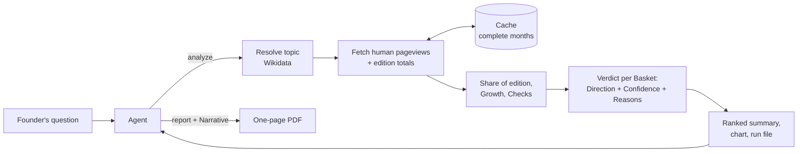

# wiki-interest

[](https://github.com/VadimZaporozhets/ai-product-engineering-case-task/actions/workflows/ci.yml)

An [Agent Skill](https://agentskills.io/specification) that helps founders of B2C products decide which topics to build next and which language audiences to launch in, using Wikipedia pageviews as a signal of interest.

Ask an agent something like *"Is interest in astronomy growing in Ukrainian Wikipedia, and how far can we trust that?"*. The skill gives it a ranked comparison with a growth direction and a confidence level for each topic and edition, the reasons behind each confidence level, a chart, and on request a one-page PDF report to share. It's built to work on a fast, cheap model. Code computes every number and every judgement, and the agent only explains them.

The skill is the [`wiki-interest/`](wiki-interest/) folder. Everything it needs to run is inside it. This README is the only other document in the repository.

## Requirements and install

- Node.js 22.18 or newer (the TypeScript source runs directly on Node, with no build step)
- npm
- Network access to `wikimedia.org` and `wikidata.org`

Install for Claude Code by copying the skill folder into your skills directory and installing its dependencies without the dev tooling:

```sh
git clone https://github.com/VadimZaporozhets/ai-product-engineering-case-task.git
cd ai-product-engineering-case-task
mkdir -p ~/.claude/skills
cp -R wiki-interest ~/.claude/skills/
npm ci --omit=dev --prefix ~/.claude/skills/wiki-interest
```

For a single project, use `<project>/.claude/skills/wiki-interest` instead. Other agents that support Agent Skills load the same folder from their own skills directory.

If Node is too old or the dependencies are missing, the skill prints the exact fix and exits. It never installs anything by itself.

Try it without an agent:

```sh
node ~/.claude/skills/wiki-interest/scripts/wiki-interest.js analyze --topics astronomy --editions uk
```

Then ask your agent one of the questions below. Each Run is saved in its own folder under `wiki-interest-runs/` in the current directory. Pageviews are cached in `~/.cache/wiki-interest` (or `$XDG_CACHE_HOME/wiki-interest`), so follow-up questions only fetch months not seen before. Set `WIKI_INTEREST_USER_AGENT` to identify your own deployment to Wikimedia.

Exit codes: `0` the Run completed; `2` the Run completed but some requests failed (those rows are marked `error:`); `3` the Run was blocked (invalid input, or a Topic that can't be analysed as asked); `4` setup error (Node or dependencies). `1` is left to Node for unexpected crashes.

To run the tests: `cd wiki-interest && npm ci && npm run typecheck && npm test`. The tests never touch the network.

## Example questions

The three questions from the task, asked in Ukrainian, and what the skill found on 2026-09-27 (Window 2024-09 to 2026-08):

| Question | Answer from the Run |
|---|---|
| *Порівняй зростання інтересу до інтервального голодування в польськомовній та чеськомовній Wikipedia за останні два роки.* (Compare the growth of interest in intermittent fasting in Polish and Czech Wikipedia over the last two years.) | Polish Wikipedia has no Article on the topic, so Polish interest can't be measured this way; that gap is itself a finding. Czech: probably declining (share of edition −47.0%), medium confidence, because a median of 232 views a month is small. |
| *Ми думаємо додати курс з астрономії до освітнього застосунку. Чи зростає інтерес до цієї теми в україномовній Wikipedia, і наскільки цьому зростанню можна довіряти?* (We're thinking of adding an astronomy course to our learning app. Is interest in this topic growing in Ukrainian Wikipedia, and how far can we trust that growth?) | It isn't growing. Probably declining (−46.4%), medium confidence, with the same small-volume reason (611 views a month). |
| *Ми створюємо застосунок для вивчення мов. Порівняй інтерес до вивчення англійської у вибраних нами мовних розділах та підготуй короткий звіт: які аудиторії варто дослідити наступними й чому?* (We're building a language-learning app. Compare interest in learning English in the editions we chose and prepare a short report: which audiences should we research next, and why?) | Asked for Polish, Turkish, Vietnamese, Indonesian and Portuguese. All five get high confidence. Vietnamese and Turkish are flat, the other three declining. Vietnamese has the highest share of its edition, Indonesian the most views. The agent writes the recommendation and says it's its own reading of the table. |

Other questions it handles: several topics in one edition ("which of yoga, meditation and pilates should we add for Polish readers?"), a Window in the user's words ("since January 2025", "the last 3 years"), a ranking criterion ("biggest audience" ranks by views), and follow-ups ("add Slovak").

### Real output

This is the unedited stdout of the first question, with local paths shortened and the `next steps:` lines trimmed:

```text
rerun: node ~/.claude/skills/wiki-interest/scripts/wiki-interest.js analyze --topics Q1666254 --editions pl,cs --months 24 --end 2026-08
window: 2024-09 to 2026-08 (24 months)

resolution:
  Q1666254 intermittent fasting: a diet that cycles between a period of fasting and non-fasting (31 Wikipedia Articles)
    chosen for "intermittent fasting" (en) from 1 exact match
    pl: Missing article, no Article is linked to Q1666254; search candidates, not analysed: "Stres oksydacyjny", "Głodówka lecznicza", "Paleolityczny styl życia"
    cs: Přerušovaný půst

ranked by growth (Growth, highest first):
| Topic | Edition | Direction | Confidence | Growth | Raw change | Median monthly views | Views per million |
|---|---|---|---|---|---|---|---|
| intermittent fasting (Q1666254) | cs | declining | medium | -47.0% | -53.6% | 232 | 4.54 |
leaders (ranked rows): none, fewer than 2 ranked rows to compare

not enough evidence (low or insufficient Confidence, Missing articles and errors; not ranked):
| Topic | Edition | Direction | Confidence | Growth | Raw change | Median monthly views | Views per million |
|---|---|---|---|---|---|---|---|
| intermittent fasting (Q1666254) | pl | none | insufficient | n/a | n/a | n/a | n/a |

reasons:
intermittent fasting (Q1666254) in cs, medium Confidence:
  - Volume: median monthly views are 232, under 1,000, so a few hundred views either way move Growth a lot.
intermittent fasting (Q1666254) in pl, insufficient Confidence:
  - Enough data: no pl Wikipedia Article is linked to this Topic's Wikidata item (a Missing article), so there are no views to judge.

caveats:
  - Interest is not willingness to pay: Wikipedia views show what people look up, not what they would buy.
  - An Edition is a language, not a country: its readers are everyone who reads that language, wherever they live.

next steps:
  - intermittent fasting (Q1666254) has no Article in pl Wikipedia. Tell the user: this is a finding about how little pl Wikipedia covers the Topic. The search candidates may be unrelated; never analyse one in its place unless the user picks it. [...]
  - For a follow-up (another Edition or Topic, a longer Window, another ranking), edit the rerun: line and run it again; months already fetched come from the cache.

run file: ./wiki-interest-runs/20260927T103128Z-27d355/run.json
chart: ./wiki-interest-runs/20260927T103128Z-27d355/chart.svg
```

None of the three Polish search candidates is about intermittent fasting (they're oxidative stress, therapeutic fasting and the paleo lifestyle). That's why the skill lists them and never analyses one on its own.

With several rows, two more lines give the agent claims it can quote instead of working them out. From the third question:

```text
| English (Q1860) | vi | flat | high | +1.6% | -23.1% | 14568 | 251.60 |
| English (Q1860) | tr | flat | high | -0.2% | -16.5% | 7673 | 65.13 |
| English (Q1860) | pl | declining | high | -10.4% | -18.3% | 8510 | 45.60 |
| English (Q1860) | pt | declining | high | -11.2% | -25.9% | 9809 | 54.69 |
| English (Q1860) | id | declining | high | -19.5% | -45.7% | 17052 | 207.83 |
leaders (ranked rows): most median monthly views: English (Q1860) id 17052 (declining); highest views per million: English (Q1860) vi 251.60 (flat); highest Growth: English (Q1860) vi +1.6% (flat); lowest Growth: English (Q1860) id -19.5% (declining)
directions (ranked rows): growing: none; flat: English (Q1860) vi, English (Q1860) tr; declining: English (Q1860) pl, English (Q1860) pt, English (Q1860) id
```

Vietnamese shows why share of edition matters: its views fell 23.1%, but Vietnamese Wikipedia as a whole shrank about as much, so its share is flat.

The agent answers in the user's language from a fixed template (mapping, Window, chart path, one line per row with its Reasons, the Caveats), and for a report it writes a small JSON Narrative (headline, 1 to 3 findings, recommendation, next step). The `report` command checks the Narrative's lengths and builds the PDF around it. The table, chart, Basket definitions, method and Caveats in the PDF all come from the Run.

## How it works



1. **Topic to articles.** The topic is matched to a Wikidata item, which links the matching Article in each language edition. If a name is ambiguous ("Mercury": the planet or the element), the skill stops and lists the meanings. If an edition has no Article on the topic, it says so and never substitutes a guess.
2. **Interest.** It fetches daily views by human readers (no bots) for exactly the months the user asked about, the Window (24 complete months by default), plus the total views of each whole edition.
3. **Share of edition.** Views are divided by the edition's total views and shown per million. Whole editions gain and lose traffic over time, so raw views alone would mix interest in the topic with changes in Wikipedia's own traffic.
4. **Growth** compares the share in the second half of the Window with the first half.
5. **Verdict.** Each topic-and-edition pair gets a Direction and a Confidence. Every lowered Confidence comes with a plain-language Reason.
6. **Ranking.** Pairs with high or medium confidence are ranked. Weak evidence is listed separately, so it never looks like the winner.

### How the Verdict works

**Direction** is growing when Growth is above +10%, declining below −10%, and flat in between.

**Confidence** comes from seven Checks. High means every Check passes, medium means one fails, and low means two or more fail. Insufficient means there's too little data to give a Direction at all.

| Check | Fails when | Why it matters |
|---|---|---|
| Enough data | no Article, data in fewer than half the months of either half, or under 100 views a month | too little to say anything (confidence becomes *insufficient*, and no other Check runs) |
| Volume | median under 1,000 views a month | small numbers swing on noise |
| Consistency | a Mann–Kendall test on the monthly share doesn't back the Direction (p ≥ 0.05, or a significant trend when flat) | a difference between halves can be a fluke |
| Spikes | the 5 busiest days hold over 25% of all views | news bursts aren't lasting interest |
| Agreement | raw views and share of edition point in opposite directions | the answer depends on how you measure |
| Full history | an Article was created or renamed partway through | there's no fair baseline |
| Seasonality | the two halves cover different calendar months (the Window isn't a multiple of 24 months) | a diet topic in January and in July isn't a fair comparison |

Each Reason names its numbers: the median, the Spike dates and their share, the month an Article appeared, or the Window length that would compare whole years. The agent has a table that maps each level to its wording: high is "interest is growing", medium "probably growing, with one reservation", low "an early signal, not evidence", insufficient "too little data".

The thresholds live in one file ([`src/thresholds.ts`](wiki-interest/src/thresholds.ts)) and were calibrated on real data (see below). [`references/metrics.md`](wiki-interest/references/metrics.md) explains every metric and Check; the agent loads it only when the user asks "why?".

## Key design decisions

1. **Share of edition, not raw views, drives the Verdict**, because whole editions lose readers to search and AI answers, and a topic at −5% in an edition that fell 10% has gained ground.
2. **Missing and ambiguous topics are reported, never guessed**, because the top Polish search hit for "intermittent fasting" was an unrelated article and the top Wikidata hit for "Mercury" was a car brand.
3. **Code computes every number and judgement, and the agent only narrates**, because cheap models miscount, missort and invent plausible numbers.
4. **Follow-ups are new Runs over a permanent cache**: the agent edits the exact command each Run prints, and only months not yet cached are fetched.
5. **TypeScript runs directly on Node 22.18+, with no build step and no auto-install**, so nothing in the skill is compiled and nothing changes on the user's machine without them.
6. **Charts and PDFs are drawn in pure JavaScript, with no headless browser**, so installing is one `npm ci` with no native builds or 150 MB browser download.
7. **The Window is exactly what the user asked for**, and seasonality lowers Confidence with a Reason instead of being silently corrected to a different question.

## Limitations

**Of the method.**

- Wikipedia interest is not willingness to pay. It's a signal for choosing what to validate next, not a demand forecast.
- A language edition is not a country. English Wikipedia is read worldwide, and Spanish Wikipedia in Spain and across Latin America.
- An Article is a proxy for a topic. The third question asks about *learning* English, and the Article is about the English language. The agent says so and can add more Articles to the Basket (`--add-article`), but nothing finds them automatically. Views of redirects and related Articles aren't counted.
- One Run covers at most 5 topics across 10 editions.

**Found in calibration.**

- "Declining" can describe a drop that ended long ago. Comparing halves can't tell "fell once" from "still falling": astronomy in English dropped in spring 2025 and has been flat since, and intermittent fasting in Ukrainian is a single step.
- Growth can overstate the size of a change when a news spike sits in one half. Pope Francis in English shows −86%, while comparing the medians of the two halves gives about −50%.
- Full history misses an Article renamed onto a title that already had a page with steady views (Eurovision in Ukrainian). The Verdict still ends up low and unranked, but no Reason mentions the rename.
- The Spikes Reason blames "a burst of news" for annual events like Halloween. The Verdict is right; the wording is off.
- One failed Consistency Check can leave a far-from-significant rise ranked at medium (COVID-19 in Polish, +19.5%, p = 0.39). Widening the flat band would fix it but turn clear, steady 12% to 15% declines into "flat", so the Reason carries the doubt instead.

**Found in the evals, on Claude Haiku 4.5.**

- Comparisons Haiku words itself, such as "the only stable audience", were false in 8 of 9 answers to the English question, even though every leader figure it quoted from the output was right.
- Free-text Ukrainian has slips (Russian words, non-words). The fixed wording is copied correctly almost every time.
- A report headline that tries to cover several rows can run past the 90-character limit. Each retry costs two tool calls, and one run needed two retries (8 calls against a budget of 4).

## How the work was verified

Most of the code, the tests and the skill instructions were generated with Claude Code, one small, tested slice at a time from a written spec. Three kinds of verification stood between that output and this repository.

**Tests.** 165 automated tests pass the CLI's entry function the same arguments the agent would, with fake Wikimedia responses and a fixed clock injected. They assert only on what it prints, the files it writes and its exit codes. The core is a table of eight synthetic series (steady growth, a news spike, a shrinking edition, a mid-Window Article, tiny volume and so on), each with its expected Direction, Confidence and failed Checks written down before the code existed. Other tests replay recorded Wikidata and pageview responses for the task's topics, and a guard fails any test that tries to reach the network. CI runs a clean install from the lockfile, the type-checker and the tests on Linux and macOS, with Node 22.18 and 24.

**Calibration on real data.** Before the thresholds were trusted, the calibration ran 43 real Baskets against the live API, 14 of them picked for a close reading: big and small editions, steady, seasonal and news-driven topics, new and renamed Articles, and a Missing article. Claude drafted a reading of each chart, and the developer checked every one against the chart and made the call. 9 of the 14 Verdicts agreed with that reading, 2 agreed partly (right Direction, overstated size) and 3 didn't. One of the three was a real bug: an Article created on a title that had been a redirect for years looked like it had a full history. A new rule, that a month counts as data only from 5% of the Article's usual views, fixed it and changed only that one of the 43 Verdicts. The other two disagreements and the partial ones are listed under Limitations. The 3× rule for picking a Wikidata item was probed on real names: it accepted names like chess, Easter and Minecraft, and stopped on Python (1.6×), Mercury (1.4×) and Halloween (2.6×, the holiday against the 1978 film). Asking costs the user one question; a wrong pick costs a wrong analysis.

**Evals with a cheap model.** Eight scenarios, each with its expected outcome written down before the first run, cover the three task questions in Ukrainian (two with a PDF), two follow-ups, a Missing article, a news spike and a wrong edition code. They ran on Claude Haiku 4.5 in headless Claude Code, with no user settings, plugins or custom skills besides this one. Each transcript was graded on a shared checklist: the mapping is shown, every number appears in the tool's output (a script flags any that don't), the wording matches the confidence, the Caveats and Reasons are stated, the PDF exists when asked, and the question takes at most 4 tool calls. Claude graded the transcripts, and the developer reviewed the grading and tightened it in four places. Each failure led to a fix in the skill instructions or the code, re-run before and after.

## Eval results

The final full round, on the skill instructions before the last round of changes described below:

| Scenario | Tool calls | Result | Note |
|---|---|---|---|
| Fasting in Polish and Czech (task question 1) | 2 | pass | Polish reported as missing, candidates named as unrelated and not analysed |
| Astronomy in Ukrainian, with a PDF (task question 2) | 4 | **fail** | the PDF headline dropped "probably" for a medium row, and the answer derived a figure ("at least halved") the tool never printed |
| English in 5 editions, with a report (task question 3) | 4 | **fail** | "highest share" given to the wrong edition, a rounded number, and countries named where the Run measured languages |
| Follow-up: add Slovak | 1 | pass | copied the `rerun:` line and appended `sk` |
| Follow-up: last three years | 1 | pass | explained why the seasonality Check lowered confidence |
| Missing article, Polish, "since January 2025" | 2 | pass | counted 20 months right; slip: suggested editions the Run didn't analyse |
| News spike: solar eclipse in German | 2 | pass | "an early signal, not evidence", with the spike days |
| Wrong edition code `by` | 3 | pass | recovered with `be` and told the user |

6 of 8 passed, and all 8 stayed within the tool-call budget. Across 124 runs (about $8.43 at API prices), the fixes moved these counts from the first round to the final one:

| Behaviour | First round | Final round |
|---|---|---|
| Ran `npm ci` before answering | 8 of 8 (3 stopped there) | 0 of 8 |
| Left out the chart path | 3 of 5 answers | 0 of 7 |
| Named an outside service (Google Trends, Yandex) | 2 of 5 answers | 0 of 8 (0 in 50 runs after the fix) |
| Made the PDF when asked | 1 of 2 | 2 of 2 (19 of 19 runs of question 3 after the fix) |
| PDF questions within 4 tool calls | 0 of 2 | 2 of 2 |

The two failures led to one more round of changes, in code as well as instructions. `analyze` now prints the leader of each column with its Direction, and it groups the ranked rows by Direction. The headline rule keeps "probably" for medium rows. A topic match with no Wikipedia Articles is dropped.

In the 9 answers to question 3 after that, every leader claim quoted with its figure was right, and both astronomy headlines kept "probably". But comparisons Haiku words on its own, like "the only stable one", were still false in 8 of those 9 answers. And on the current instructions, none of the 3 last runs of question 3 stayed within 4 tool calls, because the report headline ran over 90 characters and had to be retried. Both stay open limitations. No more output lines or rules fixed them; flagging such words for a human reader, the way numbers are flagged, is the likely next step.

Also run once on **Gemini 3.6 Flash** (medium thinking) in Google Antigravity, with the same skill folder and task question 3 in Ukrainian: pass with two slips. Every figure matched the output, the proxy was stated, the PDF headline kept the required shape, and the Ukrainian was clean. The slips were the same kind Haiku makes: countries named in the next step, and one reason ("high relative share") applied to both recommended editions when only Vietnamese has it. One sample, so it shows the skill isn't tied to one vendor, not which model is better.

## Roadmap

Each stage starts from a limitation found in this version and names the eval that would prove the stage works.

1. **Better proxies for a topic.** *Limitation:* "learning English" is measured on the Article about the English language, and a Basket only grows when the agent adds Articles by hand. *Build:* fill Baskets from redirects and Wikidata subclasses, and use Wikipedia clickstream data to find the Articles readers move between. *Proof:* on question 3, the Basket for "learning English" includes the English-as-a-second-language Articles in each edition without the agent choosing them, and the calibration readings still agree.
2. **Scale.** *Limitation:* the 5 × 10 limit per Run, and every Article's views come from the rate-limited REST API. *Build:* read the monthly bulk pageview dumps into DuckDB and Parquet, for research across thousands of Articles. *Proof:* a comparison of 200 topics across 20 editions finishes in minutes, and its Verdicts on the 43 calibration Baskets match the API-based ones.
3. **Better statistics.** *Limitation:* "declining" can mean a drop that ended long ago, a spike in one half inflates Growth, and seasonal topics lose Confidence instead of getting a Direction. *Build:* change-point detection ("when did interest change?"), seasonal decomposition, and forecasts with intervals. *Proof:* on the calibration set, astronomy in English reads "fell in spring 2025, flat since", Pope Francis's fall comes out near the −50% the medians give, and Halloween gets a Direction without the seasonality penalty.
4. **More signals.** *Limitation:* interest is not willingness to pay, and an edition is not a country. *Build:* Google Trends as a cross-check, edit activity as a sign of how well a topic is covered, and per-country top lists to go beyond language editions. *Proof:* on the three task questions, the answer flags each edition where Google Trends for the matching country disagrees with the Verdict, and each flag holds up when a person reads both charts.
